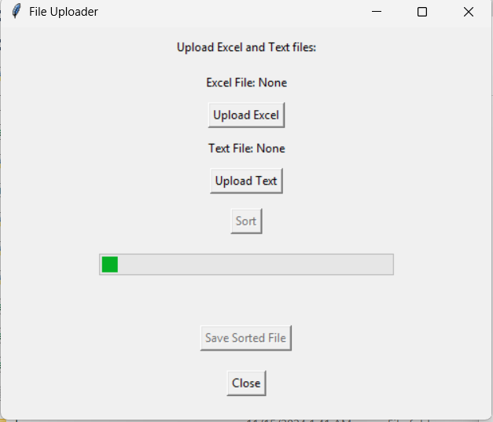
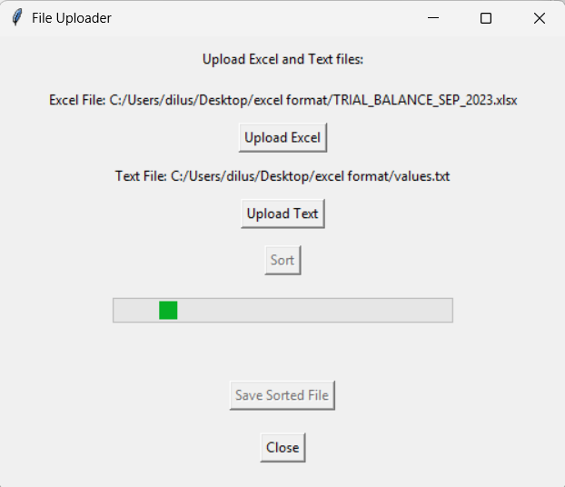

# excel-format-app

This repository contains a small Python-based application designed to sort an Excel sheet according to specific rules defined by the sheet's details. This tool is intended for use with a particular set of data and should be used with the specific template.

## Screenshots

*App*

*Sorting*

## Limitations

The sorting logic is designed specifically for a designated type of Excel data and may not work as expected with other types of data.
This tool does not connect to or utilize public datasets—processing is restricted to the uploaded Excel sheet only.